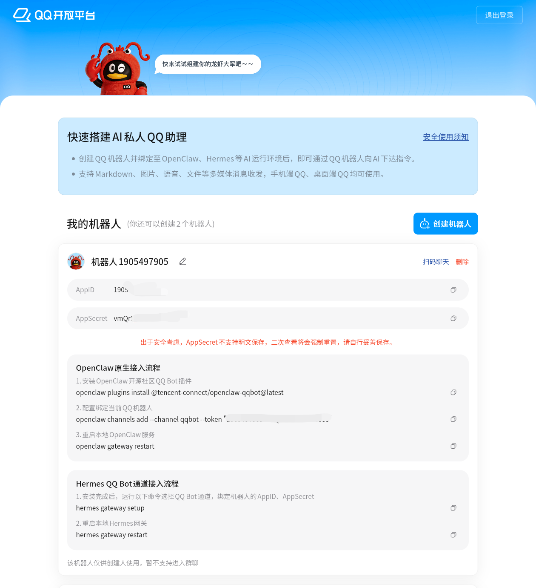
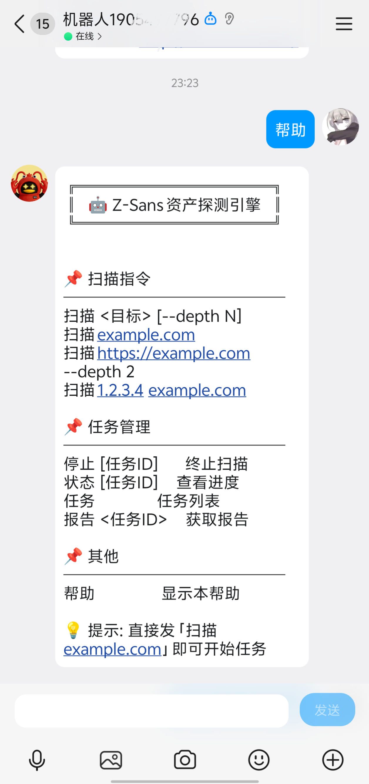
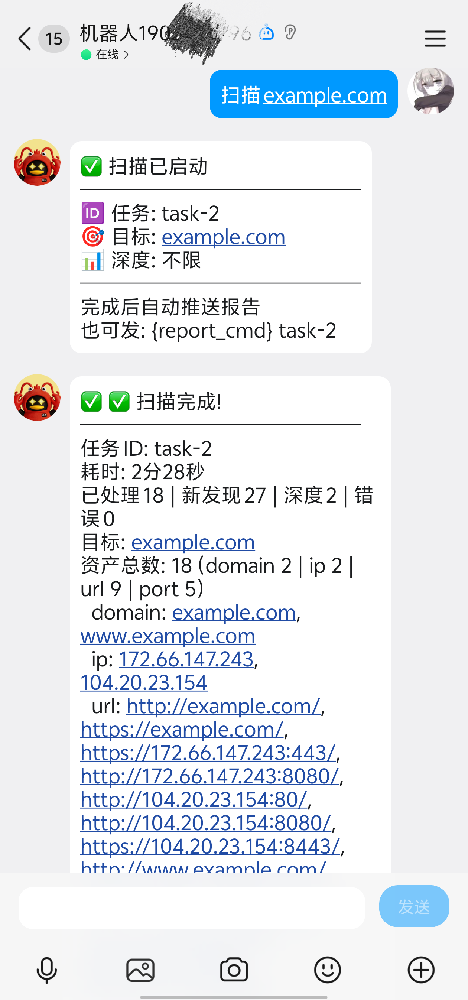

# qqbot — QQ 官方机器人插件（nonebot-adapter-qq）

通过 **QQ 官方机器人**（NoneBot2 + `nonebot-adapter-qq`）远程操控 Z-Sans 资产繁殖引擎：
在 QQ 里发一条消息即可 **启动扫描 / 终止扫描 / 查询进度 / 获取报告**，扫描完成后自动把
报告推送到会话。附带 WebUI 配置页，凭据、指令词、权限、回复模板全部可视化配置。

```
QQ 客户端 ⇄ QQ 开放平台 ⇄ nonebot-adapter-qq（本插件） ⇄ 本地 zsansapi(HTTP) ⇄ Z-Sans 引擎
```

| 项目 | 说明 |
|------|------|
| 类型 | 目录插件 |
| 依赖 | nonebot2、nonebot-adapter-qq（见 requirements.txt，Python ≥ 3.10）|
| 网络 | 出站连接 QQ 网关 + 本机回环访问 zsansapi；WebSocket 模式无需公网回调地址 |

---

## 一、安装

```bash
# 1. 把 qqbot/ 整个目录复制到 Z-Sans 的插件目录（默认 plugins/）
cp -r qqbot/ /path/to/Z-Sans/plugins/

# 2. 安装机器人依赖（建议在虚拟环境中）
pip install -r /path/to/Z-Sans/plugins/qqbot/requirements.txt

# 3. 确认插件加载
python main.py --list-plugins          # 应出现 qqbot
python main.py --help                  # 应出现 --qqbot / --qqbot-port 参数
```

> ⚠️ `nonebot-adapter-qq` 要求 **Python ≥ 3.10**。Z-Sans 主程序支持 3.9+，
> 但使用本插件的环境需为 3.10+。

## 二、获取 QQ 机器人凭据

1. 前往 [QQ 开放平台](https://q.qq.com/qqbot/#/home) 注册并创建机器人；
2. 在「开发设置」页获取 **AppID** 与 **AppSecret（机器人密钥，即 clientSecret）**；

3. 未上线的机器人先在「沙箱配置」添加测试群/成员，并保持 `sandbox: true`。

> 🔑 **access_token 无需手工获取**。按官方文档流程，调用 API 所需的
> access_token 由插件在启动时自动换取：
>
> ```bash
> curl --location 'https://api.bot.qq.com/app/getAppAccessToken' \
>      --header 'Content-Type: application/json' \
>      --data '{"appId": "你的AppID","clientSecret": "你的AppSecret"}'
> # => {"access_token":"...","expires_in":"7200"}
> ```
>
> 返回的 `access_token` 即接口调用凭证（有效期 7200 秒）。适配器会缓存并在
> 过期前自动续期；插件启动时还会做一次鉴权自检，凭据错误会直接给出原因。
> 「Token 令牌」字段**选填**——它不参与鉴权。

## 三、配置（三种方式任选，优先级从低到高）

1. 插件出厂默认：`plugins/qqbot/config.yaml`
2. 主配置文件：`breeding-config.yaml` 的 `plugins.qqbot:` 段
3. **Web 控制台（推荐）**：启动后打开 `http://127.0.0.1:8050` → 「插件」→ 找到
   **qqbot** → 点「进入」或「open」，即可在 WebUI 中填写 AppID/Token/AppSecret、开关沙箱、
   自定义指令词、编辑权限名单与全部回复模板，一键保存。

```yaml
# breeding-config.yaml 示例（方式 2）
plugins:
  qqbot:
    app_id: "123456789"
    app_secret: "your-app-secret"   # clientSecret，鉴权用
    # token: ""                     # 选填，不参与鉴权
    sandbox: true            # 未上线先开沙箱
    web_password: "本地API口令"   # 同时作为 ZSANS_WEB_PASSWORD
    allowed_users: []        # 留空=所有人可用；填 openid 可精确授权
    admins: []
    commands:
      scan: ["扫描", "scan", "跑一把"]
      stop: ["停止", "stop", "住手"]
      status: ["状态", "status"]
      tasks: ["任务", "tasks"]
      report: ["报告", "report"]
      help: ["帮助", "help"]
```

## 四、运行

```bash
cd /path/to/Z-Sans

python main.py --qqbot
# → 自动拉起 Web 服务(zsansapi, 默认 http://127.0.0.1:8050)
# → 若已配置凭据则自动启动 QQ 机器人
# → 若未配置凭据则仅保持 Web 服务运行，供在页面上配置后热启

# 组合参数（均为本插件/核心已有参数，互不冲突）：
python main.py --qqbot --port 9000          # 指定 Web 服务端口
python main.py --qqbot --qqbot-port 9001    # 指定 NoneBot 监听端口
python main.py -c my.yaml --qqbot           # 指定主配置文件
```

`--qqbot` 与核心的 `--web` 互不依赖：单独 `--web` 不启动机器人；`--qqbot` 会自动带起 Web 服务。
新增命令行参数只有两个且都带 `qqbot` 前缀，与核心参数（`-c/-d/-u/-o/--port/--host/--tools` 等）
不会冲突。

> 💡 **无需凭据也能启动**：首次运行 `--qqbot` 时若尚未填写 AppID/AppSecret，
> 进程不会退出，而是保持 Web 服务运行。打开 Web 控制台 → qqbot 插件页填写凭据
> 后点击「启动机器人」即可热启，无需重启进程。

## 五、QQ 指令

在群聊中 **@机器人** 发送（单聊直接发送）；触发词可自定义，以下为默认：

| 指令 | 说明 | 示例 |
|------|------|------|
| `扫描 <目标...>` | 启动扫描，支持域名/URL/IP 多目标混排 | `扫描 example.com --depth 3`<br>`扫描 https://a.com 1.2.3.4` |
| `停止 [任务ID]` | 终止扫描；省略 ID 时终止自己最近发起的任务 | `停止 task-1` |
| `状态 [任务ID]` | 查询进度（已处理/新发现/错误数） | `状态` |
| `任务` | 列出最近 10 个任务 | `任务` |
| `报告 <任务ID>` | 获取报告摘要 | `报告 task-1` |
| `帮助` | 显示帮助 | `帮助` |

可选参数：`--depth N`（或 `-d N`，1–10）、`--strategy priority_based|depth_first|breadth_first|time_based`。



### 报告推送说明（重要）

QQ 官方平台规定被动回复有效期约 5 分钟、每条消息最多回复 5 次。因此：

- 任务完成时机器人会尽力把报告推送回发起会话；
- 若扫描耗时超过被动时限导致推送失败，日志会提示，此时随时发送
  `报告 <任务ID>` 即可补取完整报告摘要（含资产统计、样例、输出目录与 Web 入口）。

## 六、权限模型

- `admins`：管理员，绕过所有限制，可停止/查看任意任务；
- `allowed_users`：非空时仅名单内用户可使用机器人（管理员除外）；
- `allowed_groups`：非空时仅名单内的群/频道可用（不影响单聊）；
- 非 admin 只能操作**自己在该会话发起的任务**。

> 获取 openid 的最简单办法：把用户/群先随意发条消息，启动日志里会打印对应 ID，
> 复制进 WebUI 名单即可。

## 七、WebUI 配置页

浏览器打开 Web 控制台 → 「插件」→ qqbot →「进入」，页面提供：

1. 凭据区：AppID / Secret（密文显示）、Token（选填）、沙箱与连接模式切换、事件意图勾选；
2. **机器人控制**：显示运行状态，一键启动/停止机器人（热启停，无需重启进程）；
3. 本地服务区：zsansapi 地址端口与访问口令、NoneBot 监听地址端口；
4. 权限区：用户/管理员/群 三份名单（每行一个 ID）；
5. 指令词区：六个指令各自多个别名，逗号分隔即时生效预览；
6. 扫描默认值与通知：默认深度/策略、轮询间隔、跟踪超时、报告样例上限、完成推送开关；
7. 回复模板区：全部回复文案可视化编辑（占位符改坏自动回退原文）；
8. 任务面板：实时展示最近扫描任务及状态。

保存写入 `output/plugin_config/qqbot.yaml`（不污染主配置），凭据修改后可直接
点击「启动机器人」热启，无需重启整个进程。

## 八、配置参考

| 键 | 默认 | 说明 |
|----|------|------|
| `app_id` / `app_secret` | 空 | QQ 开放平台凭据（必填；app_secret 即 clientSecret） |
| `token` | 空 | **选填**，不参与鉴权，仅个别旧接口需要 |
| `auth_base` | api.bot.qq.com/app/getAppAccessToken | 官方鉴权端点（换取 access_token），一般无需修改 |
| `auth_check` | true | 启动前自检：预先换取 access_token，失败即退出并给出原因 |
| `startup_retries` | 3 | 启动后因网络抖动(DNS 解析失败等)异常退出时的自动重启次数 |
| `sandbox` | false | 沙箱环境 |
| `use_websocket` | true | true=反向 WS；false=WebHook（需公网可达 `/qq/webhook`） |
| `intents.*` | 见 config.yaml | 事件意图；群聊场景必须 `c2c_group_at_messages: true` |
| `web_host` / `web_port` | 127.0.0.1 / 8050 | 自动拉起的 zsansapi 监听 |
| `web_password` | 空 | 非空则注入 `ZSANS_WEB_PASSWORD` 并以 Bearer 调用 API |
| `bot_host` / `bot_port` | 127.0.0.1 / 8078 | NoneBot 监听（WebHook 模式需对外） |
| `allowed_users` / `admins` / `allowed_groups` | [] | 权限名单 |
| `defaults.depth` / `defaults.strategy` | null | QQ 启动扫描时的缺省值 |
| `poll_interval` | 5 | 任务状态轮询间隔(秒) |
| `scan_timeout_hours` | 24 | 轮询超时(小时)，超时停止跟踪并提示 |
| `notify.on_complete` | true | 完成后推送报告 |
| `max_report_assets` | 10 | 报告中每类资产的样例上限 |
| `commands.*` | 中文+英文 | 各指令触发别名列表 |
| `messages.*` | 内置文案 | 回复模板，占位符如下 |

### 回复模板占位符

| 模板键 | 占位符 |
|--------|--------|
| `help` | `{help_cmd} {scan_cmd} {stop_cmd} {status_cmd} {tasks_cmd} {report_cmd}` |
| `scan_usage` | `{scan_cmd}` |
| `scan_started` | `{task_id} {seeds} {depth} {cmd_report}` |
| `scan_invalid` | `{invalid}` |
| `scan_failed` / `web_unready` | `{error}` |
| `stop_ok` / `stop_fail` / `status_not_found` 等 | `{task_id}` `{reason}` `{stop_cmd}` |
| `status_line` | `{task_id} {status} {seeds} {processed} {found} {errors} {elapsed}` |
| `tasks_header` / `task_row` / `tasks_empty` | `{status} {task_id} {seeds}` |
| `notify_complete` / `notify_stopped` / `notify_failed` | `{summary} {task_id} {error}` |
| `watch_timeout` | `{task_id} {hours} {report_cmd}` |

## 九、架构与故障排查

```
plugins/qqbot/
├── plugin.py        # 入口：__manifest__ + register_cli(--qqbot) + run_cli
│                    #   run_cli: 合并三层配置 → 守护线程拉起 zsansapi → 启动 NoneBot
├── zsans_api.py     # 本地 zsansapi HTTP 客户端(标准库实现) + 种子解析白名单
├── zsans_qq_bot.py  # nonebot 指令处理器(仅 --qqbot 模式导入)
├── webui.html       # 插件 WebUI（控制台 /api/plugins/qqbot/webui 托管）
├── config.yaml      # 出厂默认配置
└── requirements.txt
```

| 现象 | 处置 |
|------|------|
| 启动即报"未安装 nonebot2" | `pip install -r plugins/qqbot/requirements.txt`（注意 Python≥3.10） |
| 报"QQ 机器人凭据缺失" | 在 WebUI 或 breeding-config.yaml 填 app_id/app_secret（token 选填）；未填时进程不会退出，可通过 WebUI 热启 |
| 鉴权自检失败 `code=10004 机器人不存在` | AppID 填错了，到开放平台「开发设置」重新核对 |
| 鉴权自检失败"连接被拒绝/重置" | clientSecret(AppSecret) 不正确（服务端对错误密钥直接断连）或网络不通 |
| Websocket 连不上/鉴权失败 | 核对 AppID+AppSecret；沙箱账号设 `sandbox: true`；查看鉴权自检输出 |
| 群里发指令无反应 | 群聊必须 @机器人；检查 intents 是否开启 `c2c_group_at_messages` |
| 报告推送失败 | 属正常（被动消息约 5 分钟时效），用 `报告 <任务ID>` 补取 |
| 端口被占用 | `--port` 换 Web 端口；`--qqbot-port` 换机器人监听端口 |
| 8050 已有 --web 实例 | 先停旧实例或用 `--port` 换端口；两实例同时写 output/ 会冲突 |

## 十、安全建议

- 务必设置 `web_password`（机器人会把它注入 `ZSANS_WEB_PASSWORD` 保护 zsansapi）；
- 生产环境用 `allowed_users` 白名单，不要留空放行所有人；
- Token/Secret 属敏感信息：WebUI 中密文显示，请勿将配置截图或提交到公共仓库；
- 仅对授权资产发起扫描，遵守当地法律法规。
